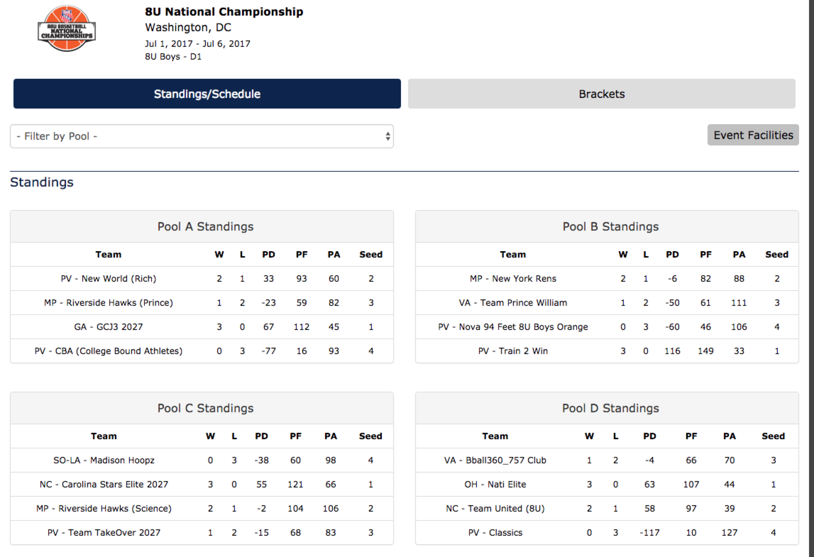
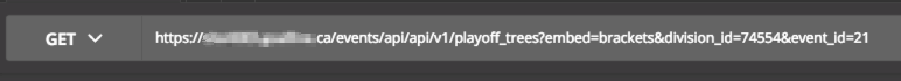
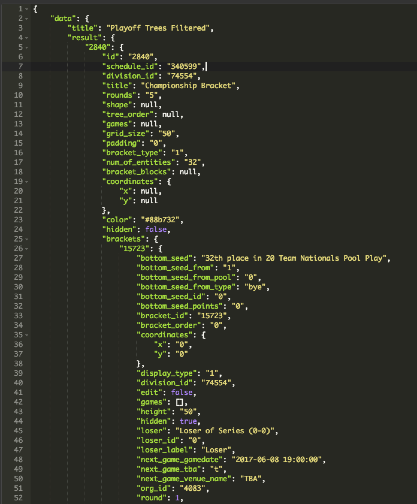

# Agile - Deveast - 2017-08-07
---
## Topics

1. What is agile?
2. Why agile?
3. Why did we decide to do agile?
4. What did we do right?
5. What should we have done better?

---

### What is agile?
> Agile software development describes a set of values and principles for software development under which requirements and solutions evolve through the collaborative effort of self-organizing cross-functional teams. It advocates adaptive planning, evolutionary development, early delivery, and continuous improvement, and it encourages rapid and flexible response to change.[1]

---

### What does agile really mean?
NO PLANNING!


---

### What is a practical definition?

> Agile is a time boxed, iterative approach to software delivery that builds software incrementally from the start of the project, instead of trying to deliver it all at once near the end. [2]

---

### A brief  history
-  'Agile' coined in 2001 in Utah [3]
---?image=images/agile_manifesto.png&size=contain

---

### Key points
1. Time-boxed
2. Iterative
3. Software delivered incrementally
4. Feedback loops are an important part
5. People over process

---

## Project background

* Sports scheduling software
* Front end
* Backend
* Mobile (Cordova, React Native)
* Team makeup

---

### Sports scheduling software
* Web based software as a service
* Allows administrators to create schedules, matchups, teams
* Separate front end and back end teams
* Restful API
* Built on an existing system

---

### Front end
* Front end written in Angular 2.0

---
### Example Screen (1)


---

### Example Screen (2)
---?image=images/schedule_2.png&size=contain

---

### Backend
* Backend written in PHP, Laravel 5.3
* Documentation-first API design using Swagger
* Unit tests on backend using PHPUnit

---

## API - sample call



+++
## API - sample response

+++?image=images/api_2.png&size=contain

---

### Sample routes

```
Route::get('events', 'EventsController@getEvents');
Route::post('events', 'EventsController@postEvents'); 
Route::get('events/{id}', 'EventsController@getEventsId');
Route::put('events/{id}', 'EventsController@putEventsId');
Route::delete('events/{id}', 'EventsController@deleteEventsId');
```

@[1-2]
@[3-5]

---

### Team makeup
* Geographically dispersed
	* Front end -  Frisco and Austin, TX
	* Backend - Halifax, NS
	* React Native - Lafayette, Indiana

---

## What worked well
1. Daily standups
2. Sprint planning (eventually)
3. Sprint retrospectives (eventually)

---

### Lessons
1. Garbage in, garbage out - good defined user stories are key
2. Need to define a reasonable velocity for each sprint, not based on timelines
3. Need to define what "done means" for the team
4. Need to present at the end of each sprint & do walk throughs
5. Still need to ensure that proper environments are setup
6. Need to ensure that cards are moved properly through QA/QC

---

### Reasons and excuses
1. Don't have training on how to write good user stories
2. Don't know what our velocity is
3. Everyone knows what done means
4. How do you present an API?
5. API not clearly defined the start

---

### Question - what is "architecture" in Agile?
---

### Question - what is "architecture"?

* The important pieces
---

## Resources

* [Presentation & Slides](https://www.gitpitch.com/sbkrogers/agile-2017) - https://www.gitpitch.com/sbkrogers/agile-2017
* [Content](https://github.com/sbkrogers/agile-2017) - https://github.com/sbkrogers/agile-2017
* [12 Principles Behind the Agile Manifesto](https://www.agilealliance.org/agile101/12-principles-behind-the-agile-manifesto/) - https://www.agilealliance.org/agile101/12-principles-behind-the-agile-manifesto/

---

## Footnotes

* [1] https://en.wikipedia.org/wiki/Agile_software_development
* [2] http://www.agilenutshell.com
* [3] https://www.agilealliance.org/agile101/the-agile-manifesto/